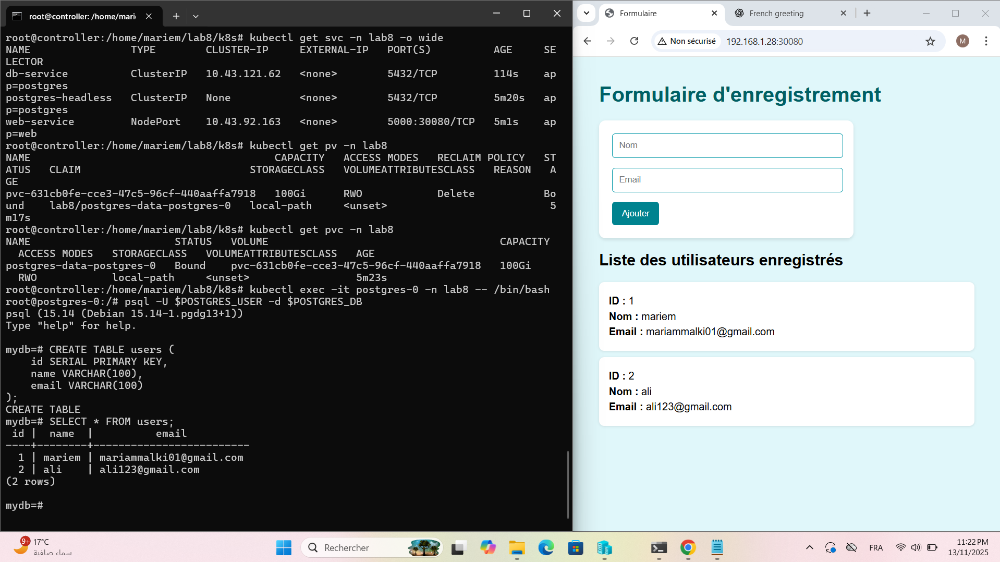

# Lab 8 – Migrating Database to StatefulSet with Advanced Persistence

## 📝 Objectif
Ce lab vise à migrer la base de données PostgreSQL du **Lab 5** (déployée via Deployment) vers un **StatefulSet** pour assurer :
- Stabilité des noms de pods et DNS
- Persistance automatique des données via `volumeClaimTemplates`
- Meilleure préparation pour la scalabilité et la haute disponibilité

Le web app reste inchangé et se connecte via un service interne (`db-service`).

---

## 📂 Structure des dossiers

lab8/
├── app/
│   ├── app.py
│   ├── templates/
│   └── requirements.tx
├── k8s/
│ ├── configmap.yaml
│ ├── secret.yaml
│ ├── postgres-headless-service.yaml
│ ├── postgres-service.yaml
│ ├── postgres-statefulset.yaml
│ ├── web.yaml
│ └── namespace.yaml
│__docs
└── README.md

## ⚙️ Déploiement

1. Créer le namespace et les configurations :

kubectl apply -f namespace.yaml
kubectl apply -f configmap.yaml -n lab8
kubectl apply -f secret.yaml -n lab8

2. Déployer la base PostgreSQL avec StatefulSet :

kubectl apply -f postgres-headless-service.yaml -n lab8
kubectl apply -f postgres-statefulset.yaml -n lab8
kubectl apply -f postgres-service.yaml -n lab8

3. Déployer la web application :

kubectl apply -f web.yaml -n lab8

4. Vérifier les pods et PVC :

kubectl get pods -n lab8 -o wide
kubectl get pvc -n lab8
kubectl get svc -n lab8

## Tests et validation

1. Connexion à PostgreSQL

kubectl exec -it postgres-0 -n lab8 -- bash
psql -U myuser -d mydb

2. Création de la table users 

CREATE TABLE IF NOT EXISTS users (
    id SERIAL PRIMARY KEY,
    name VARCHAR(100),
    email VARCHAR(100)
);
3. Accès à l’application web

NodePort : http://<IP_node>:30080

Le formulaire permet d’insérer et de lister les utilisateurs.

4. Tester persistance

Supprimer le pod postgres-0 :

kubectl delete pod postgres-0 -n lab8

Vérifier la présence des données après recréation du pod :

kubectl exec -it postgres-0 -n lab8 -- bash
psql -U myuser -d mydb
SELECT * FROM users;

Les données doivent toujours exister, confirmant la persistance via PVC.

Accès à l’application web

